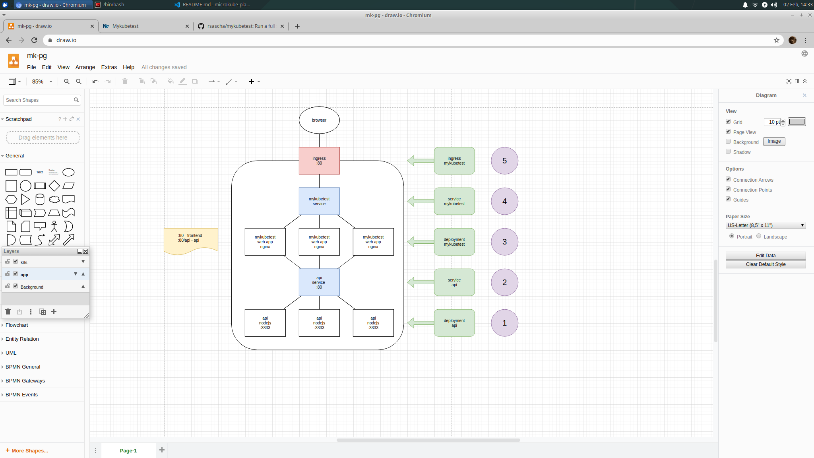

# Just a try to deploy a full stack app (powered by nx) to microkube

## Diagram of the Setup



## Setup

### Setup microk8s

To run this shit you need:

- https://microk8s.io/docs/

And move to:

```bash
cd my-fullstack-app
```

### Build the application

```bash
npm run build
```

### Configure microk8s

Use `microk8s.enable` to get the following `microk8s.status`:

```plain
microk8s is running
addons:
cilium: disabled
dashboard: disabled
dns: enabled
fluentd: disabled
gpu: disabled
helm3: disabled
helm: disabled
ingress: enabled
istio: disabled
jaeger: disabled
juju: disabled
knative: disabled
kubeflow: disabled
linkerd: disabled
metallb: disabled
metrics-server: disabled
prometheus: disabled
rbac: disabled
registry: enabled
storage: enabled
```

### Build and deploy docker images

```bash
./k8s.api.build-and-push.sh
./k8s.mykubetest.build-and-push.sh
```

### Apply deployments and services

```bash
microk8s.kubectl apply -f k8s.api.deployment.yaml
microk8s.kubectl apply -f k8s.api.service.yaml

microk8s.kubectl apply -f k8s.mykubetest.deployment.yaml
microk8s.kubectl apply -f k8s.mykubetest.service.yaml
```

### Open browser

https://localhost/
